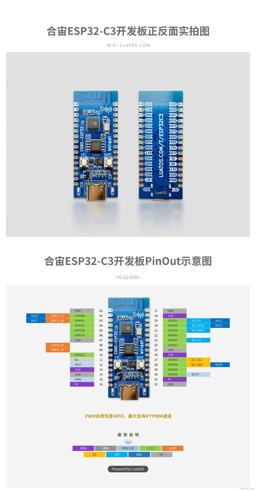

# MiRemoteBridge

ESP32-C3 双角色 BLE 桥接固件：把**小米蓝牙遥控器 2 Pro（RC003）**变成一台**标准蓝牙键盘 + 媒体控制设备**，免驱、不改系统、不影响反作弊，Windows 与 iOS 均已实测可用。

```
┌──────────────────────────┐   BLE (HOGP + ATVV 控制通道)   ┌──────────────────────────┐
│  小米蓝牙遥控器 2 Pro    │ ─────────────────────────────► │   ESP32-C3               │
│  (RC003)                 │ ◄───────────────────────────── │   Central + Peripheral   │
└──────────────────────────┘                                └────────────┬─────────────┘
                                                                         │ BLE (HID Keyboard +
                                                  固定容量事件队列        │  Consumer Control)
                                                  + 键码转换              ▼
                                                              ┌──────────────────────────┐
                                                              │  Windows / iOS / …       │
                                                              │  · 标准蓝牙键盘           │
                                                              │  · 标准媒体控制设备       │
                                                              │  免驱，无需任何软件       │
                                                              └──────────────────────────┘
```

> 项目边界：只处理按键。不涉及遥控器麦克风与音频，不实现 USB HID / USB UAC、
> Windows 伴侣程序、虚拟声卡、内核驱动、注入或 Wi-Fi/Web 后台。
>
> 当前版本 **v0.0.1**：git tag 与固件自报版本（`config.h` 的 `BRIDGE_FW_VERSION`）
> 手工同步，改一边必须改另一边，固件那侧要重新烧录才生效。

---

## 功能特性（全部真机实测）

- **13 键全转发**，含 4 个媒体键（音量± / 返回 / 语音）。RC003 的私有键码在空口被
  完整接收并转换为标准 HID 报告。原始码逐键实测确认，纠正过第三方资料的 4 处错误。
- **电量透传**：桥接器把遥控器电池服务的真实电量（实测 97–98%）发布为自己的
  Battery Level，并持久化——主机在任何时刻连接读到的都是真实值，而不是占位的 100%。
- **快速重连**：重启到按键生效 **3.3 秒**（含 ESP32 启动、上游重连、服务发现、
  订阅、Windows 重连）。达到普通蓝牙键盘断电重连的水平。
- **多主机**：可配对多台主机（Windows / iOS 实测），自动切换、自动重连；
  配对记录有保护策略，遥控器的 bond 永远不会被新主机挤掉。
- **运行时键位自定义**：返回 / 电源 / 语音三个键可通过串口命令换绑（键盘组合键、
  媒体键或关闭），保存在 NVS，重启不变。
- **串口控制台**：状态查询、扫描、手动连接、bond 管理、合成按键注入、延迟测量、
  设备端自检——所有功能不接主机也能诊断。
- **防卡键**：幂等按下/松开 + 报告全量重建 + 任一侧断线立即清零，三层保证
  Windows 上永远不会有键卡住。
- **测试基建**：宿主端模型检查（11096 项断言，含 4000 步随机不变量测试）+
  设备端自检（137 项向量 + 44 项分发仿真），宿主与设备消费同一份期望值向量；
  Web 页面另有 **125 项断言**（不接板子，约 1 秒，用本机 Chrome 跑真 DOM）。
- **Web 配置界面**：开机自动连上 Wi-Fi 并提供按键映射页面（手机 / 电脑浏览器直接访问），
  逐键绑定电脑快捷键或媒体键，配置持久化；按下遥控器时页面**即时推送**高亮
  （WebSocket，不是轮询）。首次访问设置访问密码，浏览器可保存；忘记密码时
  按住 BOOT 5 秒恢复出厂。
- **双状态指示灯**：板上 D5 / D4 分别指示电脑链路与遥控器链路，呼吸 = 等待、
  快闪 = 连接中、常亮 = 就绪；按住遥控器按键时对应灯熄灭（现场确认按键已被接收）。

---

## 兼容性

| 角色 | 设备 | 状态 |
| --- | --- | --- |
| 遥控器（上游） | 小米蓝牙遥控器 2 Pro（RC003） | ✅ 实测（13 键 + 电量） |
| 主机（下游） | Windows 10 / 11 | ✅ 实测（键盘 + 媒体键 + 蓝牙关开重连 + 多主机切换） |
| 主机（下游） | iPhone / iPad（iOS BLE HID） | ✅ 实测（音量键、方向键） |
| 主机（下游） | Linux / macOS / Android | 未验证。标准 BLE HID，理论上可用，欢迎反馈 |
| 遥控器（上游） | 其他小米/通用 BLE 遥控器 | 未验证。串口 `raw on` 核对原始码后按 [`docs/KEYMAP.md`](docs/KEYMAP.md) 加表即可 |

---

## 为什么需要它

RC003 的音量、返回等键把**私有键码**塞在 HID 报文的按键槽里（如 `0x80`/`0x81`/`0xF1`）。
这些不是合法的 HID Usage，Windows 的 `kbdhid.sys` 会在内核层直接丢弃，应用层手段
（全局 Hook、RawInput、AutoHotkey）同样拿不到。本固件以 Central 身份连接遥控器，
在空口完整收到这些码，转换成标准 HID 报告后再以蓝牙键盘的身份发给主机——
所以主机侧完全免驱。

---

## 硬件与准备

| 项 | 要求 |
| --- | --- |
| 主控 | ESP32-C3 开发板（实测：合宙 CORE-ESP32，CH343 USB 转串口款） |
| 遥控器 | 小米蓝牙遥控器 2 Pro（RC003），已充电 |
| 工具链 | Arduino CLI 1.5.1 + arduino-esp32 3.3.11（见下方目录说明） |

**工具链不在仓库内**：Arduino CLI 位于 `.tools/`（不入 Git），arduino-esp32 数据目录
在 `C:\code\arduino-c3-data`（不入 Git，**必须纯 ASCII 路径**——乐鑫 RISC-V 链接器
处理中文路径不可靠）。首次使用请按 [`docs/TESTING.md`](docs/TESTING.md) 的指引安装。

### 开发板与按键

实测使用的开发板（合宙 CORE-ESP32，引脚图见
[`docs/images/esp32c3-board.jpg`](docs/images/esp32c3-board.jpg)）：



板上两个按键在固件中的角色：

| 按键 | 引脚 | 行为 |
| --- | --- | --- |
| **BOOT** | GPIO9 | **恢复按键**（固件实现）：短按无操作（仅日志）；**按住 5 秒 = 恢复出厂设置**（清除全部配对与设置并重启），按住期间每秒打印倒计时 |
| RESET | EN | 硬件复位芯片，固件不参与（等同于断电重开） |

> 注意：上电瞬间按住 BOOT 仍会进入 ROM 下载模式（烧录用），这是芯片的
> strapping 行为，与上述运行时功能互不干扰。恢复出厂也可以在串口输入
> `factory` 达成，效果相同。

### 状态指示灯（D4 / D5）

板上两颗 LED 分别指示两条链路，语义完全一致：**呼吸 = 等待，快闪 = 正在连接，
常亮 = 已就绪**。不接电脑、不看日志，也能一眼判断桥接器到哪一步了。

| LED | 引脚 | 指示对象 | 呼吸（等待） | 快闪（连接中） | 常亮（已连接） |
| --- | --- | --- | --- | --- | --- |
| **D5** | GPIO13 | 电脑 / 手机（下游主机） | 无连接，正在广播 | 已建链路，HID 尚未就绪 | HID 已订阅，按键可用 |
| **D4** | GPIO12 | 遥控器（上游 RC003） | 搜索中（空闲 / 扫描 / 退避） | 正在连接或发现服务 | 已订阅，可转发 |

**遥控器按键反馈**：按住任意遥控器按键时 **D4 熄灭**，松开恢复——这是"桥接器
确实收到了这个键"的现场确认（用的是与串口 `status`、Web UI 相同的按键状态）。

> 引脚说明：这两颗 LED 在 QIO flash 模式下会被 SPIHD/SPIWP 占用；本板强制
> **DIO 模式**（见下方 FlashMode 说明），所以 GPIO12/13 可以自由使用——两块
> 需求恰好互相成全。

---

## 快速开始

```powershell
# 1. 编译
.\scripts\build.ps1

# 2. 查看接了哪些串口（不给 -Port 时只检测，绝不烧录）
.\scripts\flash.ps1

# 3. 显式确认端口并烧录（先只读探测芯片，不是 ESP32-C3 就中止）
.\scripts\flash.ps1 -Port COM3

# 4. 打开串口控制台
.\scripts\monitor.ps1 -Port COM3
```

不需要硬件就能跑的全部检查：

```powershell
.\scripts\test.ps1        # 重新生成测试向量 + 宿主端模型检查 + 编译
```

> 如果脚本"什么都不做"：PowerShell 5.1 在同时存在 `http_proxy` 与 `HTTP_PROXY`
> 环境变量时无法启动子进程，`scripts/_common.ps1` 已自动处理。

**配对流程**（两步，顺序随意）：

1. **配对遥控器**：串口敲 `scan`（带序号列出附近设备）→ `connect <序号>`；
   或直接 `connect <mac>`。连上即自动配对、绑定、发现服务、订阅。
2. **配对主机**：Windows/iPhone 的蓝牙设置里添加 `Mi Remote Bridge`，
   无需在桥接器上做任何操作——它无主机连接时永远处于可配对广播状态。

详细步骤、日志样例与排查表见 [`docs/PAIRING.md`](docs/PAIRING.md)。

---

## 按键映射（实测值）

| 物理键 | 原始码（实测） | 默认输出 | 备注 |
| --- | --- | --- | --- |
| 音量 + / − | `0x80` / `0x81` | Consumer Vol Up / Down | Consumer 报告，不抢焦点 |
| 返回 | `0xF1` | Consumer AC Back | 可改 `kb_esc` / `kb_alt_left` |
| 上 / 下 / 左 / 右 | `0x52` / `0x51` / `0x50` / `0x4F` | ↑ ↓ ← → | 标准键盘 Usage |
| 确定 | `0x28` | Enter | |
| 主页 | `0x4A` | Win + D | 第三方写的 `0x24` 作为同义词保留 |
| 菜单 | `0x65` | 空格 | 同义词 `0x5D` |
| 电视 | `0x35` | F8 | 同义词 `0xC0` |
| 电源 | `0x66` | Alt + F4 | 可改 Sleep / Power / Esc |
| 语音 | `0x3E` | **左 Ctrl + 左 Win**（和弦） | 可改右 Alt+, / Mute / 关闭 |

- **未知键码宁可漏发**：不在表内的码丢并记 WARN，绝不盲发。
- **运行时换绑**：`map back|power|voice <模式>`，NVS 持久化；`map` 查看当前值。
- 完整说明、同义词与 HID 描述符设计见 [`docs/KEYMAP.md`](docs/KEYMAP.md)。

---

## 日常行为说明

### 重连速度

重启（ESP32 或主机）到按键生效约 **3.3 秒**。关键在三处：服务发现按"HID 优先"
两遍扫描、连接参数在加密后立即协商、链路监督超时缩短为 1 秒（硬复位无法发断开包，
遥控器要等监督超时才重新广播——库默认 4 秒是这个延迟的真凶）。详见
[`docs/TESTING.md`](docs/TESTING.md) §4.8。

### 电量

桥接器没有自己的电池，它把遥控器电池服务的真实值透传给主机并持久化在 NVS。
BLE 电量永远是外设自报的（任何主机都没有独立测量手段），粒度取决于遥控器固件。

### 多主机

- 可配对多台主机（每台一条 bond 记录），同时只能连接一台，断开后其他已配对
  主机自动接管（实测 iPhone ↔ Windows 切换 <0.1 秒）。
- Bond 槽位共 3 个（预编译库上限）：遥控器恒占 1 个 + 主机侧 2 个。
- **配对保护**：新主机配对前固件会主动腾位，且**永远不删遥控器的 bond**——
  被保护的是"当前绑定的遥控器"这个角色，换遥控器后自动跟随。
- 清除：`forget win` 清所有主机 bond（保留遥控器），`forget rc` 清遥控器侧，
  `factory` 全清。**清配对必须两侧同时清**（桥接器 + 主机蓝牙里删除设备），
  单侧清会导致密钥不一致、每 6–7 秒断开重连一次。

### NFC 的结论（实测）

RC003 上的 NFC 是一张 **ISO 14443-4 智能卡**（复旦微芯片，小米私有 APDU 应用）：
碰触只发生在手机与卡之间（小米手机读私有配对令牌触发投屏；iPhone 可按卡片
**UID** 触发快捷指令），**蓝牙侧零交互**——实测碰触期间桥接器无任何数据。
"通过 NFC 给蓝牙传数据"在本硬件上不可行，桥接器也未实现 NFC。

---

## 配置界面（Web UI，常开）

固件**开机后自动加入已保存的 Wi-Fi 网络**并提供按键映射页面。这个界面是**常开的**：
`wifi off` 会被明确拒绝（Wi-Fi 与 BLE 共享射频，但配置可达性优先）。

```
首次：串口 wifi join <ssid> <password>      # 记一次即可，之后每次开机自动加入
查看：串口 wifi status                      # 打印 http://<ip>/ 与堆余量
```

1. 浏览器打开板子地址（`wifi status` 打印的那个 `http://<ip>/`）
2. **首页**查看遥控器 / 主机连接、最近上报电量与自定义映射数量
3. 打开**按键映射**：点卡片或遥控器示意图上的按键 → 选**键盘快捷键**或
   **媒体动作** → 保存并回读确认。支持左右修饰键、仅修饰键组合与单键恢复
4. 按键实时反馈：按下遥控器时页面对应按键立即高亮（见下）

### 访问密码（可选，首次访问时设置）

页面有**自定义登录页**（不是浏览器弹框）——**只有一个密码字段**。

- **首次访问**（设备无密码）：自动进入**设置页**，填密码并确认一次 →
  **直接跳进应用**（会话当场生效，不用再输一遍）
- **再次访问**：直接进（cookie 7 天有效）；过期后回到登录页**只填密码**
- 密码只存 SHA1 哈希；cookie = `HMAC(sha1(密码), 时间戳)`，偷到也不能反推密码
- 忘记密码：按住 BOOT 5 秒清空一切；或串口 `pass clear`

- 密码**只存 SHA1 哈希**，从不明文落 NVS
- cookie = `HMAC(sha1(密码), 时间戳)`，有效期 7 天；偷到 cookie 不能反推密码
- 登出：在浏览器里访问 `/logout`（或清掉 `mrb_sess` cookie）

- 密码以 **SHA1 哈希**存在 NVS，不存明文；页面与 WebSocket 都需要它
- WebSocket 无法携带认证头（浏览器的限制），所以页面先用已认证的请求
  `GET /api/token` 取一个**派生令牌**，再用 `ws://…/ws?token=…` 连接
- 串口命令：`pass <new>` 改密码，`pass clear` 清除（下次访问重新设置），
  `pass` 查看当前状态
- **忘记密码**：**按住板上的 BOOT 键 5 秒** —— 清空全部设置与配对（Wi-Fi 密码、
  网页密码、按键映射、蓝牙配对）并重启，设备回到出厂状态，重新设置即可
  （这也是出厂恢复的统一入口）

> 安全边界，如实说明：HTTP 与 WebSocket 都是**明文**（这台设备装不下 TLS——
> mbedtls 会话要 16–40 KB，而双 BLE 链路下只剩约 30 KB）。因此密码防的是
> **局域网内的误入与好奇**，不是网络抓包。**请勿把本设备暴露到公网**
> （不要在路由器上做端口转发）。

**实时响应（WebSocket 推送，不是轮询）**：页面与设备之间是一条
**WebSocket 长连接**——设备一转发按键就把事件推给页面，**不是页面去问**。
同一个连接反向承载配置命令（读取映射、保存、恢复默认），所以页面既不轮询
也不占用额外的服务槽。

> 为什么是 WebSocket 而不是 SSE：SSE 是单向的，页面仍需另一条通道写配置，
> 而这台设备的服务端一次只服务一个连接——两条通道会互相阻塞。WebSocket
> 双向、单连接，正好。
>
> 连接保活：设备每 10 秒发一个 ping（浏览器自动回 pong），30 秒收不到任何
> 数据就主动断开并释放服务槽——否则一个"消失的客户端"会永久占住配置服务。
>
> 另外固件关闭了 Wi-Fi 省电（modem sleep）：省电模式下每个请求要等下一个
> 信标窗口，滞后 100–300 ms。板子由 USB 供电，这点功耗换"按下即亮"很划算。

**遥控器示意图按真实比例绘制**：方向盘中心位于机身 22% 高度、直径占机身宽
80%；顶部电源 / 语音两键在 9% 高度；左右两列在 37% / 47% / 57% 高度且严格
水平对齐（音量 +/− 对齐返回 / 主页，TV 对齐菜单）；TV 行以下的空白与实物一致。

`bind` 串口命令可完成同样的事（`bind list` 列表）。页面底部"恢复默认映射"
经确认后清空全部自定义绑定（包括串口绑定），**保留串口 `map` 基础模式与蓝牙配对**，
不等同于恢复出厂。页面显示实际生效的映射，不把静态默认表冒充当前状态。

页面完全离线自包含（无外部字体、脚本或图片请求），也不包含任何遥测。
```powershell
python tests/tools/web_ui_preview.py
# 浏览器打开 outputs/web-ui-preview.html
```

**联网方式**：配置页走 **STA**——桥接器加入你家 Wi-Fi，和电脑/手机在同一网段，
开机 8 秒后自动连上（已保存网络时），串口 `wifi status` 打印地址。想彻底关掉用
`wifi off`；没有可用 Wi-Fi 时 `wifi ap on` 可退回 AP 热点（见下方命令表）。

**为什么要知道堆水位**：Wi-Fi 与 BLE 共享射频和内存，开 Wi-Fi 后堆从 ~87 KB 降到
约 **30 KB**（最大连续块 ~20 KB）。STA 下够用；AP 模式还要再吃掉约 38 KB，
在堆已很低时它的 DHCP 会发不出地址（客户端退化成 169.254.x.x）。

---

## 串口控制台

115200 波特率，输入 `help` 看全表。常用：

| 命令 | 作用 |
| --- | --- |
| `status` | 全量状态：两侧连接、bond、电量、队列、当前按键、内存 |
| `scan` / `scan now` | 查看扫描器缓存 / 开始新一轮扫描 |
| `connect <序号\|mac> [public\|random]` | 手动连接 |
| `reconnect` | 断开并重连遥控器 |
| `forget rc` / `forget win` | 清除遥控器侧 / 主机侧配对（见 RECOVERY.md 的双侧清规则） |
| `bond list` | 列出所有配对记录 |
| `key <hex> press\|release` | 注入合成按键（不接遥控器即可验证主机侧） |
| `raw on\|off` / `lat on\|off` / `log <0-4>` | 原始报文 / 延迟 / 日志级别 |
| `map back\|power\|voice <模式>` | 运行时键位，NVS 持久化 |
| `selftest` / `sim` | 设备端自检（向量 + 分发仿真） |
| `wifi on\|off\|status` | 开/关 Web 配置页（STA，加入已保存网络；`status` 打印地址与堆余量） |
| `wifi join <ssid> <pass>` | 保存配置页要加入的网络（开放网络用 `""`） |
| `wifi ap on\|off` | 退回 AP 热点模式（无可用 Wi-Fi 时的兜底，堆占用更高） |
| `factory` | 清除全部配对与设置并重启 |

---

## 架构

```
firmware/MiRemoteBridge/
├── MiRemoteBridge.ino   入口：setup / loop
├── config.h             编译期开关与时机参数
├── key_definitions.h    RC003 原始键码 + 标准 HID Usage（纯 C，无依赖）
├── keymap.{h,cpp}       键码 → HID 动作映射 + 运行时可选模式（纯 C，无依赖）
├── rc003_report.{h,cpp} 报文解析 + 按下/松开状态机（纯 C，无依赖）
├── event_queue.h        固定容量无锁 SPSC 环形队列
├── bridge_events.h      事件类型定义
├── event_bus.{h,cpp}    全局事件队列实例
├── ble_core.{h,cpp}     唯一的 BLE 栈初始化点
├── ble_bonds.{h,cpp}    Bond 查询/删除/腾位保护
├── hid_gatt.{h,cpp}     下游 HID 服务：直接用 NimBLE ble_gatt_svc_def 构建
│                        （两条 0x2A4D 特征——封装层做不到，见 docs/KEYMAP.md §5）
├── hid_report_map.h     HID 报告描述符 + 报告布局常量
├── hid_server.{h,cpp}   下游 HID 外设封装（防卡键、订阅、电量）
├── rc003_client.{h,cpp} 上游：扫描/连接/服务发现/订阅，独立 FreeRTOS 任务
├── bridge.{h,cpp}       事件分发、按键状态、延迟测量、status
├── log.{h,cpp}          分级日志 + 令牌桶限速 + 不限流通道
├── cli.{h,cpp}          串口控制台
└── selftest.{h,cpp}     设备端向量测试 + 分发仿真
```

### 关键设计决定

- **单一 NimBLE 主机栈，双角色并存。** Arduino-ESP32 3.3.11 的 C3 构建里
  `CONFIG_BT_NIMBLE_ENABLED=y`，核心自带 `BLE` 封装底层就是 NimBLE；
  `ble_core::begin()` 是唯一调用 `BLEDevice::init()` 的地方。
- **BLE 回调只入队。** 上游通知回调运行在 NimBLE host 任务，只做"解析 → 归一化 →
  入 SPSC 队列"；HID 报告全部由 `loop()` 发送，两角色不重入。
- **阻塞操作放独立任务。** 扫描、连接、发现、订阅由 `rc003` FreeRTOS 任务承担。
- **直连优先。** 保存的身份地址 + Bond 直连，失败才回退扫描；扫描占空比运行
  （20 秒扫描 / 3 秒停顿），给并存的下游链路留空口时间。
- **HID 服务绕过 `BLEHIDDevice` 直接建在 NimBLE 上。** HOGP 要求"每个报告 ID 一条
  Report 特征"，两条 `0x2A4D` 是必须的；Arduino 封装层按 UUID 去重注册不了第二条
  （详见 [`docs/KEYMAP.md`](docs/KEYMAP.md) §5），NimBLE 原生 `ble_gatt_svc_def`
  没有这个限制。
- **未知键码宁可漏发。** 不在表内的码丢并记 WARN，绝不盲发。

---

## 踩坑实录（开源最值钱的部分）

以下问题全部在真机上复现过，完整取证在 [`docs/TESTING.md`](docs/TESTING.md) §4：

1. **板子必须 `FlashMode=dio`。** FQBN 默认 `qio` 把 flash 驱动配成 QIO（镜像头仍是
   DIO），部分板子的 Macronix flash 在 QIO 下不回应，bootloader 读到全 0xFF →
   `invalid magic number` 复位循环。实测 80M+QIO ❌ / 40M+QIO ❌ / 80M+DIO ✅。
2. **两个顶层集合共用一条 Report 特征 = Windows 拒绝启动 HID**（`Code 10`，
   问题状态 `0xC0110002` = `HIDP_STATUS_INVALID_REPORT_TYPE`）。合法 HID ≠ Windows
   接受；必须"每个集合自己的报告 ID + 各自的 Report 特征"。
3. **Arduino BLE 封装层注册不了两条同 UUID 特征**，第二条被静默丢弃且其 `m_pService`
   永不赋值 → `notify()` 读野指针、芯片崩溃。这是把 HID 服务下沉到 `ble_gatt_svc_def`
   的原因。
4. **`BLEClient::connect()` 的 timeout 参数被库忽略**；**`BLEAddress` 内部字节逆序**，
   用 `getNative()` 拼字符串再喂回去会得到反序地址——地址一律用 `toString()` 的
   规范文本形式。
5. **链路监督超时是硬复位恢复速度的旋钮**：库默认 4 秒，硬复位无法发断开包，
   遥控器会陪一个不存在的主机干等 4 秒。缩短到 1 秒后重启恢复快了 3 倍，
   代价为零。
6. **惰性发现与遍历顺序**：`getCharacteristics()` 首次访问才做 ATT 发现，
   且服务 map 按 UUID 字符串排序（电池排在 HID 前）。"先按键后电池"必须把
   过滤放在惰性调用**之前**。
7. **清配对必须两侧同时清**：只清桥接器侧，主机还留着旧密钥 → 每 6–7 秒
   断开重连一次（MTU 从 256 掉到 23），期间按键丢失。

---

## 验证状态与诚实边界

| 层级 | 状态 |
| --- | --- |
| L1 编译 | ✅ 编译通过（flash **43%** / 全局 RAM **14%**，DIO + huge_app；不代表 Wi-Fi 运行时堆占用） |
| L2 宿主端模型验证 | ✅ 11096 项断言（含 HID 描述符真实解析、4000 步随机不变量） |
| L2 页面回归 | ✅ 125 项断言（不接板子，本机 Chrome 跑真 DOM，约 1 秒；热点三态逐键校验） |
| L3 设备端自检 | ✅ 真机：`137 passed / 0 failed` + 分发仿真 `44 passed / 0 failed` |
| L4 上游 RC003 → C3 | ✅ 真机：13/13 键、0 未知码；延迟 min 190 / median 215 / max 361 µs |
| L4 下游 C3 → Windows | ✅ 真机：键盘 + 媒体键；多主机切换（Windows ↔ iPhone） |
| L4 边界项 | 🔄 长按、连按、两侧同时重启、卡键等清单在 [`docs/TESTING.md`](docs/TESTING.md) §5 |

**没有声称的**：Linux/macOS/Android 主机、非 RC003 遥控器、第 4 台设备触发
bond 腾位的完整流程——这些未实测。所有"编译验证"与"真机验证"在文档中严格区分。

---

## 项目结构与测试

```
tests/
├── vectors/key_vectors.json    解析/状态机/键表/模式 的唯一权威向量
├── tools/gen_vectors.py        生成 firmware/MiRemoteBridge/selftest_vectors.h
├── tools/gen_web_page.py       把 web_page.h 拆成三份 gzip 资产（web_page_gz.h）
├── tools/check_web_ui.py       闪存预算 + 125 项页面断言（本机 Chrome，不接板子）
├── tools/check_all.py          四项硬件检查一次跑完（需板子）
├── tools/spot_audit.py         逐键打印遥控器热点的三态计算样式（诊断用）
├── tools/board_auth.py         硬件脚本共用的串口/HTTP/断言工具
└── model/check_vectors.py      宿主端模型检查 + HID 描述符解析 + 随机不变量测试
```

设备端 `selftest` 消费同一份 JSON 生成的 C 头文件，**设备与宿主不会对期望值分歧**。
不接板子的全套：`.\scripts\test.ps1`（生成物 → 模型检查 → 页面断言 → 编译）。

---

## 文档

| 文件 | 内容 |
| --- | --- |
| [`docs/PAIRING.md`](docs/PAIRING.md) | 上游/下游配对步骤、日志样例、排查表 |
| [`docs/KEYMAP.md`](docs/KEYMAP.md) | 13 键完整表、可配置模式、HID 描述符与服务结构 |
| [`docs/RECOVERY.md`](docs/RECOVERY.md) | Bond 清除、故障恢复矩阵、防卡键设计 |
| [`docs/TESTING.md`](docs/TESTING.md) | 四层验证状态、实机联调记录、验收清单、延迟测量 |
| [`docs/THIRD_PARTY_NOTICES.md`](docs/THIRD_PARTY_NOTICES.md) | 第三方引用核查与许可证结论 |

---

## 致谢

- [GetSayAll/remote-mic-app-windows](https://github.com/GetSayAll/remote-mic-app-windows)
  （GPL-3.0）——本项目的 Web 配置界面在**布局与交互设计**上参考了它的按键映射页
  （按键卡片环绕遥控器、逐键配置槽）。我们未复制其源码或素材文件，页面为独立实现；
  它对 RC003 的按键码与配对行为的公开记录也帮助了键表核对。
- [cuicui-V5/RemoteMapper-ESP32](https://github.com/cuicui-V5/RemoteMapper-ESP32)——
  最早被参考的同类项目；其记录的 RC003 原始键码帮助本项目起步（其中 4 个码后来在
  真机上纠正，见 [`docs/KEYMAP.md`](docs/KEYMAP.md) §1）。

感谢以上项目的作者与社区。

---

## 许可证

本项目以 **GPL-3.0-or-later** 发布，见 [`LICENSE`](LICENSE)。选择 copyleft 是为了让
所有基于本项目的改进同样开源。第三方引用与素材边界见
[`docs/THIRD_PARTY_NOTICES.md`](docs/THIRD_PARTY_NOTICES.md)。
