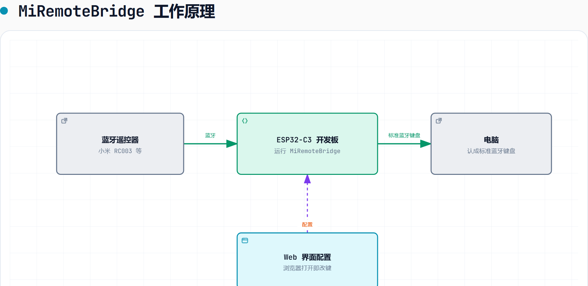

# MiRemoteBridge

[English](README.md) | **简体中文**

> ESP32-C3 双角色 BLE 桥接固件，把**蓝牙遥控器**变成电脑认得的标准蓝牙键盘 + 媒体控制设备。

🔗 官网（烧录 / 配网 / 改键都在这）：**https://qyhhhh.github.io/BleRemoteBrideg/**

## 这是什么

一个跑在 ESP32-C3 开发板上的开源固件，让电脑把遥控器**当成普通的蓝牙键盘**：

- 不需要装驱动、伴侣程序或后台服务
- 不需要碰 Windows 系统或注册表
- 不需要管理员权限
- 不会触发游戏的反作弊检测、也不会被杀毒软件拦
- 按键完全本地转发，没有任何遥测

**适用场景**：

- 家里有闲置的蓝牙遥控器或想用最便宜的机顶盒蓝牙遥控器，想给电脑当遥控
- 不想给电脑装任何软件、也不想折腾驱动、避免游戏的反作弊检查

## 解决什么问题

市面上的蓝牙遥控器主要分两类，都有痛点：

| 类型 | 痛点 |
|---|---|
| **小米遥控器（RC003）** | 把音量、返回、电源键的**私有码**塞进 HID 报文，Windows 直接丢弃 |
| **标准 HOGP 遥控器**（如中国移动、中国电信盒子配的） | 不能在电脑上使用 |

本固件以 Central 身份连接遥控器，把任意码翻译/透传成标准 HID 报告后再以"蓝牙键盘"身份发给电脑，**电脑看到的就是一个普普通通的蓝牙键盘**。

## 优势

| 优势 | 说明 |
|---|---|
| **极低成本** | ESP32-C3 开发板约 **10 元** + 一只标准 BLE 遥控器 **5–15 元** = 整套 15–25 元搞定 |
| **完全免驱** | 电脑认成标准蓝牙键盘 + 媒体控制设备，主流系统（Windows / Linux / macOS）即插即用 |
| **不需要装软件** | 想改键？浏览器打开板子页面就行，不需要装客户端、不需要装驱动 |
| **不改系统** | 不动 Windows 注册表、不动系统驱动、不动组策略；卸载只拔 USB |
| **不影响游戏反作弊** | 纯 HID 设备，Riot Vanguard / EAC / BattlEye 等主流反作弊放行 |
| **不被杀毒拦** | 不开后台、不写自启动、不联网（除非你主动打开配置页），没有任何可疑行为 |
| **不需要管理员权限** | 配对走标准的 Windows 蓝牙设置；烧改用 USB 串口，普通用户即可操作 |
| **蓝牙键盘兼容性最好** | 输出标准 HID Keyboard + Consumer Control 报告，所有 PC 系统通用 |
| **支持两款遥控器** | 小米 RC003（13 键 + 电量）与中国移动 `CMCC_Voice_Remote` 已实测端到端可用；其它标准 BLE 遥控器走学习型模式直接接入 |

## 兼容性

| 角色 | 设备 | 状态 |
| --- | --- | --- |
| 遥控器（上游） | 小米蓝牙遥控器 2 Pro（RC003） | ✅ 实测（13 键 + 电量） |
| 遥控器（上游） | 中国移动语音遥控器（`CMCC_Voice_Remote`） | ✅ 实测端到端可用，**部分物理键无响应**（详见 [`docs/CMCC-BLE-REMOTE.md`](docs/CMCC-BLE-REMOTE.md)） |
| 主机（下游） | Windows 10 / 11 | ✅ 实测（键盘 + 媒体键 + 蓝牙关开 + 多多主机切换） |
| 主机（下游） | Linux / macOS | 未验证；标准蓝牙 HID，理论可用，欢迎反馈 |
| 主机（下游） | iPhone / iPad / iOS | ✅ 实测（键盘 + 媒体键 + 多主机切换，详见 [`docs/PAIRING.md`](docs/PAIRING.md)） |
| 遥控器（上游） | 其它标准 BLE 遥控器 | 走**学习型槽位**，标准 HID 键名自动识别，**无需改代码**。仅 CMCC 一款逐键实测过 |

## 快速开始

整套烧录、配 Wi-Fi、改键都在网页里完成——**不需要装软件、不需要串口命令**。

1. **打开官网**：https://qyhhhh.github.io/BleRemoteBrideg/ （见本文顶部链接）
2. **接上板子**：用 USB 线把 ESP32-C3 开发板接到电脑
3. **网页烧录**：在官网页面点"安装"按钮，浏览器自动选串口并烧录固件
   （用的是 [ESP Web Tools](https://esphome.github.io/esp-web-tools/)，基于 Web Serial，
   **无需装任何客户端**——只要桌面版 Chrome / Edge / Opera）
4. **配置 Wi-Fi**：烧录完成后页面引导你填家里 Wi-Fi 的 SSID 和密码
5. **打开配置页**：板子连上 Wi-Fi 后，页面自动跳转到板子自己的配置页
6. **完成**：现在按下遥控器，电脑有响应；想改键就在配置页里点卡片

> **串口命令**（`status` / `scan` / `connect` 等）**仅供调试**——所有用户操作
> 都在网页里完成。命令参考见 [`docs/SERIAL-CONSOLE.md`](docs/SERIAL-CONSOLE.md)，
> 故障排查见 [`docs/PAIRING.md`](docs/PAIRING.md)。

## 文档导航

### 给使用者

- [`docs/PAIRING.md`](docs/PAIRING.md) — 上游 / 下游配对步骤、串口命令、故障排查
- [`docs/RECOVERY.md`](docs/RECOVERY.md) — Bond 清除、故障恢复矩阵、防卡键设计
- [`docs/KEYMAP.md`](docs/KEYMAP.md) — 13 键完整表、可配置模式、HID 描述符与服务结构
- [`docs/WEB-UI.md`](docs/WEB-UI.md) — 配置页使用、访问窗口、安全边界、堆水位
- [`docs/SERIAL-CONSOLE.md`](docs/SERIAL-CONSOLE.md) — 串口命令一览、监控陷阱

### 给开发者

- [`docs/ARCHITECTURE.md`](docs/ARCHITECTURE.md) — 代码结构、关键设计决定、模块边界
- [`docs/TESTING.md`](docs/TESTING.md) — 四层验证状态、实机联调记录、验收清单
- [`docs/PITFALLS.md`](docs/PITFALLS.md) — 踩坑实录（开源最值钱的部分）
- [`docs/RELEASING.md`](docs/RELEASING.md) — 固件发布流程、产物清单、命名契约
- [`docs/AUTH.md`](docs/AUTH.md) — 认证机制设计历史（为什么改成 30 分钟窗口）

### 调研档案（"为什么不做"）

- [`docs/CMCC-BLE-REMOTE.md`](docs/CMCC-BLE-REMOTE.md) — 中国移动遥控器 MIC 校验失败的排查与现状
- [`docs/MIC-AUDIO-FEASIBILITY.md`](docs/MIC-AUDIO-FEASIBILITY.md) — 麦克风音频四种架构评估（结论：不做）
- [`docs/HANDOFF-websocket-debug.md`](docs/HANDOFF-websocket-debug.md) — WebSocket 调试结案记录
- [`docs/THIRD_PARTY_NOTICES.md`](docs/THIRD_PARTY_NOTICES.md) — 第三方引用与许可证结论

## 致谢

- [GetSayAll/remote-mic-app-windows](https://github.com/GetSayAll/remote-mic-app-windows)（GPL-3.0）——
  本项目的 Web 配置界面在**布局与交互设计**上参考了它的按键映射页（按键卡片环绕遥控器、
  逐键配置槽）。未复制其源码或素材文件，页面为独立实现；它对 RC003 的按键码与配对行为
  的公开记录也帮助了键表核对。
- [cuicui-V5/RemoteMapper-ESP32](https://github.com/cuicui-V5/RemoteMapper-ESP32)——
  最早被参考的同类项目；其记录的 RC003 原始键码帮助本项目起步（其中 4 个码后来在
  真机上纠正，见 [`docs/KEYMAP.md`](docs/KEYMAP.md) §1）。

## 许可证

本项目以 **GPL-3.0-or-later** 发布，见 [`LICENSE`](LICENSE)。
选择 copyleft 是为了让所有基于本项目的改进同样开源。
第三方引用与素材边界见 [`docs/THIRD_PARTY_NOTICES.md`](docs/THIRD_PARTY_NOTICES.md)。